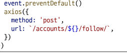
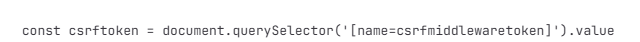
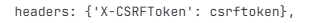

# JavaScript

## 목차
[비동기](#비동기)

## 비동기
동기(Synchronous)와 비동기(Asynchronous)

**비동기**: 특정 작업의 실행이 완료될 때까지 기다리지 않고 다음 작업을 즉시 실행하는 방식

예시: setTimeout() 비동기함수라 즉시 실행하지 않고 예약만 한 뒤 다음 코드로 넘어감

- 동기 특징
    - 시작 순서대로 처리
    - 앞 작업이 끝나야 다음 작업 시작 가능
    - 단순, 예측 가능
    - 시간 오래 걸리는 작업 실행되면 해당 작업 끝날때까지 프로그램 전체가 멈춤
    - 시스템 자원 낭비

- 비동기 특징
    - 병렬적 수행
    - 당장 처리 완료할 수 없는 작업들은 백그라운드에서 실행되며 빨리 완료되는 작업부터 처리
    - 시간 오래 걸리는 작업을 백그라운드에 위임해서 효율성 증가
    - 프로그램이 멈추지 않아 사용자 경험 향상
    - 작업 시작 순서와 완료 순서가 다를 수 있어서 코드의 복잡성 증가

JavaScript는 Single Thread 언어로 동시에 여러 작업 처리할 수 없음. 어떻게 비동기 처리할 수 있을까?

>> 브라우저, Node.js

- 브라우저 환경에서 JavaScript 비동기 처리 관련 요소
    - Call Stack
    - Web API
    - Task Queue
    - Event Loop

## Ajax
Asynchronous JavaScript and XML

비동기적인 웹 애플리케이션 개발을 위한 기술

Ajax는 웹 페이지 전체를 새로고침하지 않고, 백그라운드에서 서버와 데이터를 주고 받는 비동기 통신 기술.

구글 지도 앱 움직여도 끊김이 없고, 좋아요 눌렀을 때 페이지 부분적으로 바뀜.

웹 페이지를 데스크톱 애플리케이션처럼 동적이고 반응적으로 만들어주는 현대 웹 핵심 기술 중 하나

- 정의: XMLHttpRequest 기술 사용하여 복잡하고 동적인 웹 페이지를 구성하는 방식

- 목적: 비동기 통신, 부분 업데이트, 서버 부하 감소

***

### 기존 방식과 차이
- 기존 방식
    - 클라이언트에서 form 채우고 서버로 제출
    - 서버는 요청에 따라 데이터 처리 후 새로운 웹 페이지 작성하여 응답으로 전달
    - 모든 요청에 따라 새로운 페이지, 새로고침
    - 기존 페이지와 유사해도 중복 코드 다시 받아 낭비

- Ajax 방식
    - XHR 객체 생성 및 요청
    - 서버는 필요한 부분에 대한 데이터만 처리 후 응답
    - 기존 페이지 일부를 수정 (새로고침X)
    - 서버에서 모두처리되던 데이터 처리의 일부가 클라이언트 쪽에서 처리되어 교환되는 데이터양과 처리량이 줄어듦

## Axios
브라우저와 Node.js환경에서 모두 사용할 수 있는 Promise 기반의 HTTP 클라이언트 라이브러리

간편하게 Ajax 통신을 할 수 있도록 도와주는 JavaScript 라이브러리

비동기 HTTP 통신을 위해 인기있게 사용됨

- 특징
    - 브라우저를 위한 XHR 객체 생성
    - Promise 기반의 비동기 요청을 처리

- Ajax 활용한 클라이언트 서버 간 동작
    - XHR 객체 생성 및 요청
    - 응답 데이터 생성
    - JSON 데이터 응답
    - Promise 객체를 활용해 DOM 조작(웹 페이지 일부만 재로딩)

- Axios 설치 및 사용
    - CDN 방식으로 사용
    - axios 객체를 활용해 요청 보낸 후 응답 데이터 promise 객체를 받음

- Promise object
    - 자바스크립트에서 비동기 작업을 처리하기 위한 객체
    - 비동기 작업의 최종 완료(또는 실패)와 그 결과값을 나타냄

    - .then()으로 작업이 성공적으로 완료되었을 때 실행될 콜백 함수를 지정하고 .catch()로 작업이 실패했을 때 실행될 콜백함수를 지정

## Ajax와 Axios

- Ajax 
    - 하나의 특정 기술을 의미하는 것이 아니라, 비동기적인 웹 애플리케이션 개발에 사용하는 기술들의 집합을 지칭. 
    - 즉 개념이자 접근 방식

- Axios
    - 클라이언트 및 서버 사이 HTTP 요청 만들고 응답 처리하는 데 사용되는 자바스크립트 라이브러리.
    - Promise API를 기반으로 비동기 처리 더 쉽게 실현하는 구체적인 도구

## 비동기 처리
핵심: 작업이 시작되는 순서가 아닌 완료되는 순서에 따라 처리됨. 

코드 실행 순서가 불명확하다는 단점. 실행 결과를 정확히 예측하며 코드 작성하기 어려울 수 있음

비동기 처리 관리방법: 비동기 콜백, Promise

1. 비동기 콜백

- 비동기적으로 처리되는 작업이 완료되었을 때 실행되는 함수
- 연쇄적으로 발생하는 비동기 작업을 순차적으로 동작할 수 있게 함
- 작업 순서와 동작을 제어하거나 결과를 처리하는 데 사용

2. Promise
- then 메서드 통해 여러 비동기 작업 연결하는 chaining 
    - then을 계속 이어나가면서 작성 가능
    - 비동기 작업의 순차적인 처리 가능하게 함
    - 이전 promise 결과를 다음 then()에서 인자로 받아 사용 가능 
    - 코드 직관적, 가독성 좋게 작성 가능 
    
- catch 메서드 통해 Promise 체인 전체의 에러를 한 곳에서 처리 가능

## 비동기 팔로우 구현 실습
1. axios CDN 작성

body 하단에
2. form 요소 선택. action과 method 속성 삭제
3. form 요소에 이벤트 핸들러 할당. submit 이벤트 기본 동작 취소 event.preventDefault()
4. axios 요청 코드 작성

5. 요청에 필요한 user_pk 가져오기
form에 data-user-id="{{ person.pk }}"
script에서 const userId = event.currentTarget.dataset.userId
6. csrf 토큰

7. view 함수. 팔로우 여부 변수 추가
JsonResponse로 응답
8. 팔로우 요청 후 장고 서버로부터 받은 응답 데이터 확인
.then(response)
9. 응답 데이터 is_followed 에 따라 팔로우 버튼 조작
10. view 함수 팔로워 팔로우 인원 연산, context 전달

## 비동기 좋아요 구현
버블링
요소의 공통 조상에 이벤트 핸들러 하나만 할당하고 event.target 이용하여 실제 이벤트 발생한 버튼 찾기.